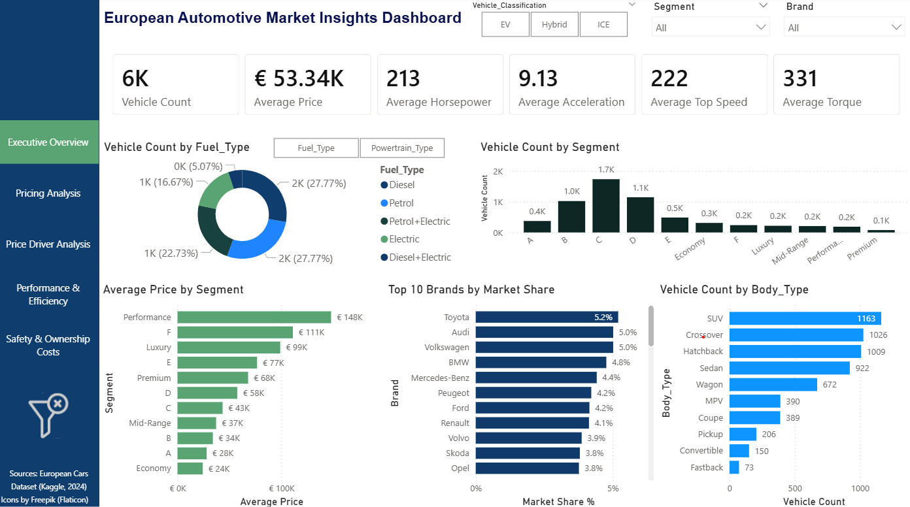
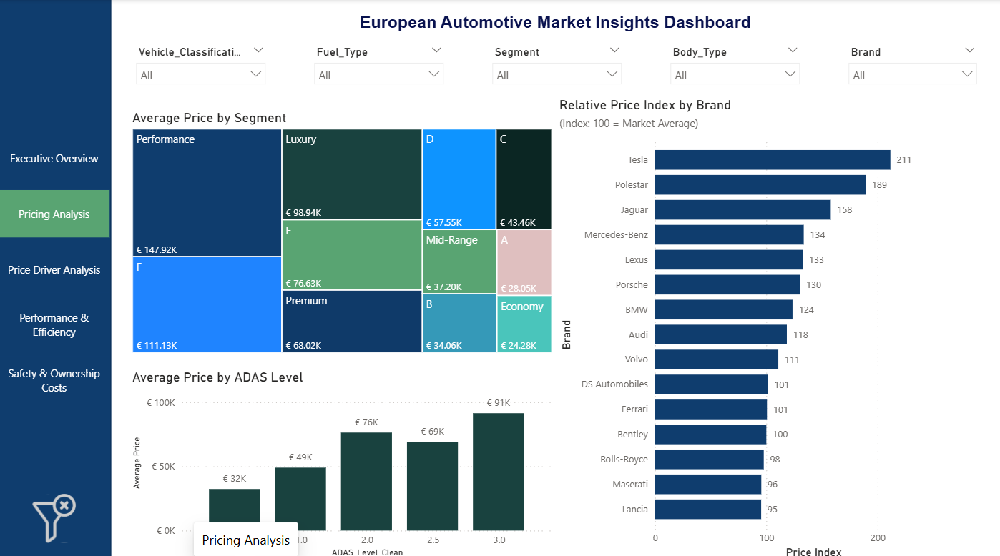
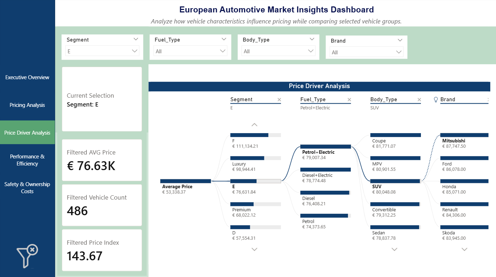

## Factors Influencing Vehicle Prices and Market Positioning in the European Automotive Market

designed by aleksandarlittlewolf - Magnific.com

### Project Overview

This project analyzes a dataset of passenger vehicles available in the European market to identify the factors that influence vehicle pricing and market positioning.

Using exploratory data analysis, interactive Power BI dashboards, and machine learning regression models, the project investigates how performance, technology, electrification, efficiency, safety features, and vehicle segmentation contribute to market value.

The findings support a non-European automotive manufacturer seeking to enter the European market by providing data-driven insights for product positioning, pricing strategy, feature prioritization, and market entry decisions.

### Project Motivation

A non-European automotive manufacturer planning to enter the European passenger vehicle market must understand which vehicle characteristics drive customer value and pricing.

By identifying the attributes most strongly associated with vehicle prices, the stakeholder can make informed decisions regarding product design, technology investments, market positioning, and pricing strategy.

### Objective

The primary objective of this project is to identify the factors that influence vehicle prices and evaluate whether vehicle characteristics can accurately predict market value. Since the target variable, Price (EUR), is a continuous numerical variable, the task is formulated as a regression problem.

### Dataset
Source: [Kaggle - European Car Dataset](https://www.kaggle.com/datasets/eswarpanchakarla/european-cars-dataset)  
Features included:
|Column                         |Description                                                |Typical Range*/Values|
|---|---|--|
|Brand	                        |Vehicle manufacturer or brand.                                     |- |
|Body Type	                    |Vehicle body configuration describing the vehicle's design and form factor.                         |Convertible, Coupe, Crossover, Fastback, Hatchback, MPV, Pickup, SUV, Sedan, Wagon|
|Segment                        |Vehicle market segment or positioning category. Segments A–F generally classify vehicles from small city cars (A) to large luxury vehicles (F), while additional categories indicate market positioning.                             |A, B, C, D, E, F, Economy, Mid-Range, Premium, Luxury, Performance|
|Usable Battery (kWh)           |Usable battery capacity available for driving (0 for ICE cars).    |0–120 kWh|
|Real Range (km)	            |Estimated real-world driving range (km).	                        |180–1100 km|
|Efficiency (Wh/km)	            |Energy consumption per kilometer traveled (Wh/km).                 |130–700 |
|0–100 km/h (s)	                |Time required to accelerate from 0 to 100 km/h.	                |3–14 s|
|Top Speed (km/h)	            |Maximum achievable vehicle speed (km/h).                           |140–250 km/h|
|Towing Capacity (kg)	        |Maximum towing capacity (kg).                                      |0–2500 kg|
|Price (EUR)	                |Average vehicle market price in euros.                             |€18,000–€120,000|
|Charging Time (min)	        |Time required for a full charge (0 for ICE cars).          	    |0–60 min|
|Max Charging Power (kW)	    |Maximum supported charging power (kW).	                            |0–350 (kW)|
|Horsepower (HP)	            |Engine or motor output in horsepower.          	                |70–700 H|
|Torque (Nm)	                |Maximum rotational force produced by the engine or motor (Nm).     |100–1000 Nm|
|Maintenance Cost (€/year)	    |Estimated annual maintenance cost in euros.	                    |€200–€1200|
|Seating Capacity	            |Number of passenger seats.         	                            |2–8|
|Boot Capacity (L)	            |Cargo or luggage compartment capacity in liters.                   |0–994 L|
|ADAS Level	                    |Level of Advanced Driver Assistance Systems available in the vehicle. Higher values indicate more advanced assistance features.                                    	                 |0–3|
|Safety Rating (Euro NCAP)	    |Vehicle safety rating according to Euro NCAP (stars).             	|1–5|
|Usage Type	                    |Intended primary vehicle usage.                                    |Personal, Commercial, City, Mixed, Sports, Highway|
|Energy Cost (€/100km)	        |Estimated energy or fuel cost per 100 km driven in euros.         	|€3–€18|
|Insurance Rating	            |Ordinal classification representing relative insurance risk and cost. Higher ratings are generally associated with more expensive and higher-performance vehicles.                       |1–10|
|Powertrain Type	            |Vehicle propulsion system.                                     	|Petrol,Diesel,Hybrid,EV|
|Fuel Type	                    |Primary energy source used by the vehicle.                         |Petrol,Diesel,Petrol+Electric/Diesel+Electric//Electric|

### Tools & Technologies

- Python
- Pandas
- NumPy
- Matplotlib
- Seaborn
- Scikit-learn
- XGBoost
- Power BI
- Jupyter Notebook

### Workflow

1. Data Collection & Understanding
2. Data Cleaning & Preprocessing
3. Exploratory Data Analysis (EDA)
4. Hypothesis Testing
5. Feature Engineering
6. Power BI Dashboard Development
7. Predictive Modeling
8. Model Evaluation & Error Analysis

### Hypotheses
- H1: Vehicles with higher performance characteristics tend to have higher market prices. 
- H2: Vehicles equipped with more advanced technology features tend to command higher market prices. 
- H3:Premium, Luxury, Performance, E-, and F-segment vehicles exhibit higher average prices than lower vehicle segments. 
- H4:Electrified vehicles occupy higher price ranges than conventional internal combustion engine vehicles. 
- H5:Vehicle characteristics can explain a substantial proportion of vehicle price variation, resulting in accurate price predictions (R² > 0.90).

### Model Scope

The predictive models were developed using vehicle specifications, performance metrics, technology features, efficiency measures, safety indicators, and vehicle classifications.

To improve interpretability and reduce redundancy, several variables were excluded from the predictive modeling stage:
- Model_Name and Brand were removed because the objective was to evaluate how vehicle characteristics influence market value rather than capture manufacturer-specific pricing effects.
- Fuel_Type was excluded due to its overlap with Powertrain Type.
- Segment_System and Vehicle_Classification were removed because they contained information already represented by other vehicle segmentation variables.
- ADAS_Level was replaced with a cleaned and standardized version of the feature.

This approach allowed the analysis to focus on the relationship between vehicle specifications, technology features, market positioning, and vehicle prices.

### Model Performance

| Model | RMSE (€) | R² |
|---------|---------:|---------:|
| Dummy Regressor | XX,XXX | -0.00 |
| Linear Regression | 4,3XX | 0.973 |
| XGBoost | 4,6XX | 0.969 |

Linear Regression achieved the strongest predictive performance while remaining highly interpretable, making it the preferred model for explaining vehicle pricing.

### Interactive Dashboard

#### Executive Overview

#### Pricing Analysis

#### Price Driver Analysis

### Key Findings

- Vehicle prices are strongly associated with performance characteristics such as horsepower, torque, top speed, and acceleration.
- Advanced technology features, including higher ADAS levels and larger battery capacities, are associated with higher vehicle prices.
- Premium, Luxury, Performance, E-, and F-segment vehicles command substantially higher prices than lower vehicle segments.
- Electrified vehicles generally occupy higher price ranges and exhibit greater price variability than conventional vehicles.
- Vehicle characteristics explain a substantial proportion of price variation, with the best-performing model achieving an R² greater than 0.97.